### Edin Emanuel Montenegro Vásquez - 201709311, Grupo: 12

# Practica 2 - Redes de Computadoras 1

De acuerdo al enunciado de la practica, para las direcciones IP hay una "X" la cual debe de ser reemplazada por la sumatoria de los últimos dos números del carnet, mas el numero del grupo. En este caso: **X = 1 + 1 + 12 = 14** 

Quedando las direcciones IP en VPC's de la siguiente manera:

| Topología | Dirección IP      | Gateway       |
| --------- | ----------------- | ------------- |
| 1         | 192.168.141.10/24 | 192.168.141.1 |
| 2         | 192.168.141.20/24 | 192.168.141.1 |
| 3         | 192.168.142.10/24 | 192.168.142.1 |
| 4         | 192.168.142.20/24 | 192.168.142.1 |
| 5         | 192.168.143.10/24 | 142.168.143.1 |
| 6         | 192.168.143.20/24 | 142.168.143.1 |

Dirección IP en routers:

| Topología | Dirección de RED | Primera Dirección Asignable | Gateway |
| --------- | ---------------- | --------------------------- | ------- |
| R1-R2     | 172.141.0.0/16   | 172.141.0.1                 | N.A.    |
| R1-R3     | 172.142.0.0/16   | 172.142.0.1                 | N.A.    |
| R3-R2     | 172.143.0.0/16   | 172.143.0.1                 | N.A     |

## Configuración de puertos en Switch para colocar en Modo Truncal

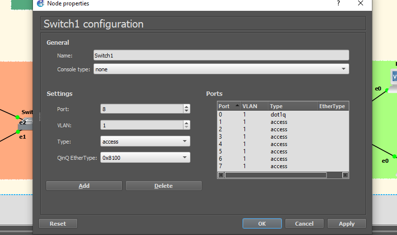

como se puede observar el puerto cero esta en modo dot1q (trunk), esto debido a que en ese puerto se conecta al router, y esto se hace para cada switch en el puerto que esta conectado al router, en esta practica el puerto e0 de cada switch se configuro en modo trunk para la conexión con el router.

## Configuración del modo FastEthernet y puertos serial en cada Router

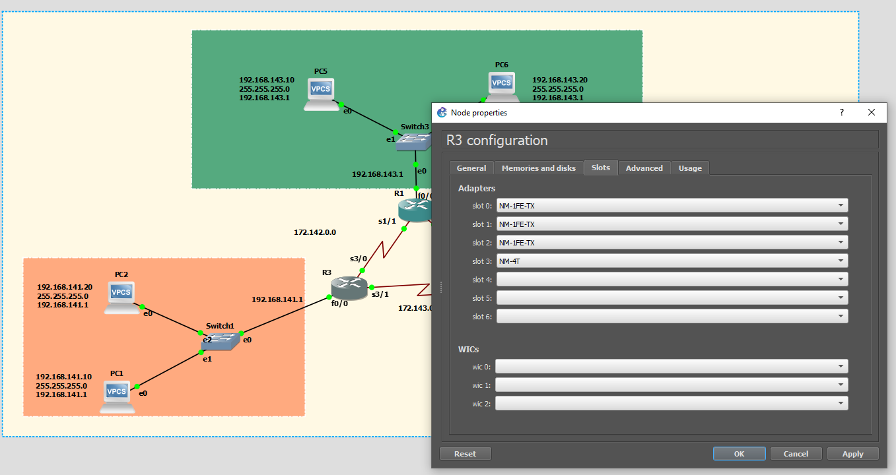	

## Conexion entre Routers

- R1 - R2 ---- S1/0 - S2/0
- R1 - R3 ---- S1/1 - S3/0
- R2 - R3 ---- S2/1 - S3/1

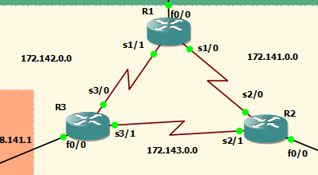

## Esquema General:

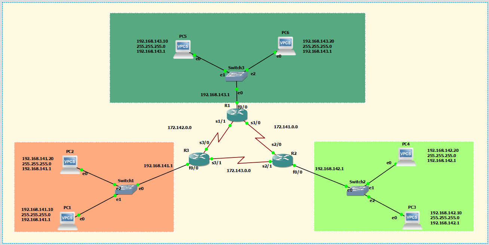

## Configuracion en VPC

**VPC1**

ip 192.168.141.10/24 192.168.141.1

**VPC2**

ip 192.168.141.20/24 192.168.141.1

**VPC3**

ip 192.168.142.10/24 192.168.142.1

**VPC4**

ip 192.168.142.20/24 192.168.142.1

**VPC5**

ip 192.168.143.10/24 192.168.143.1

**VPC6**

ip 192.168.143.20/24 192.168.143.1

## Configuracion Routers (comunicación entre switch)

**R1**

- [ ] configure terminal
- [ ] interface f0/0
- [ ] ip address 192.168.143.1 255.255.255.0
- [ ] no shutdown
- [ ] exit

**R2**

- [ ] configure terminal
- [ ] interface f0/0
- [ ] ip address 192.168.142.1 255.255.255.0
- [ ] no shutdown
- [ ] exit

**R3**

- [ ] configure terminal
- [ ] interface f0/0
- [ ] ip address 192.168.141.1 255.255.255.0
- [ ] no shutdown
- [ ] exit

## Configuración de Routers (Comunicacion a VPC)

**R1 --> R2**

- [ ] configure terminal

- [ ] int s1/0

- [ ] ip address 172.141.0.1 255.255.0.0

- [ ] no shutdown

  

**R2 --> R1**

- [ ] configure terminal
- [ ] int s2/0
- [ ] ip address 172.141.0.2 255.255.0.0
- [ ] no shutdown

**R1 --> R3**

- [ ] configure terminal
- [ ] int s2/0
- [ ] ip address 172.142.0.1 255.255.0.0
- [ ] no shutdown

**R3 --> R1**

- [ ] configure terminal
- [ ] int s2/0
- [ ] ip address 172.142.0.2 255.255.0.0
- [ ] no shutdown

**R3 --> R2**

- [ ] configure terminal
- [ ] int s3/1
- [ ] ip address 172.143.0.1 255.255.0.0
- [ ] no shutdown

**R2 --> R3**

- [ ] configure terminal
- [ ] int s2/1
- [ ] ip address 172.143.0.2 255.255.0.0
- [ ] no shutdown

## Routers (Enrutamiento Estático)

**R1 - R2**

- [ ] configure terminal
- [ ] ip route 192.168.142.0 255.255.255.0 172.141.0.2

**R2 - R1**

- [ ] configure terminal
- [ ] ip route 192.168.143.0 255.255.255.0 172.141.0.1

**R1 - R3**

- [ ] configure terminal
- [ ] ip route 192.168.141.0 255.255.255.0 172.142.0.2

**R3 - R1**

- [ ] configure terminal
- [ ] ip route 192.168.143.0 255.255.255.0 172.142.0.1

**R3 - R2**

- [ ] configure terminal
- [ ] ip route 192.168.142.0 255.255.255.0 172.143.0.2

**R2 - R3**

- [ ] configure terminal
- [ ] ip route 192.168.141.0 255.255.255.0 172.143.0.1

## Capturas de configuración de routers

### Router  1

- sh ip interface brief 

  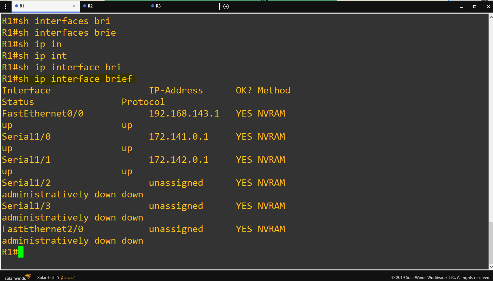

- sh ip ro

  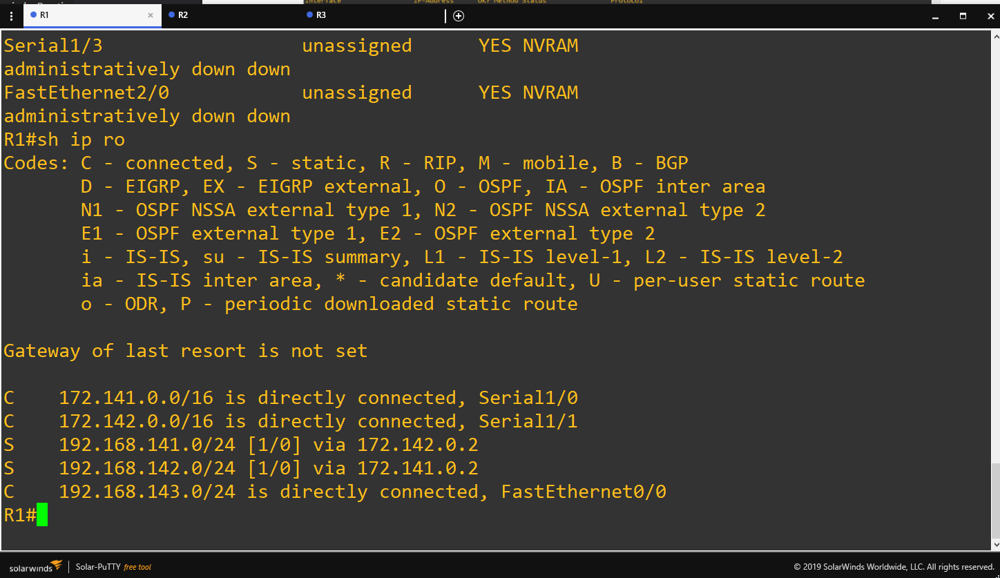

### Router 2

- sh ip interface brief

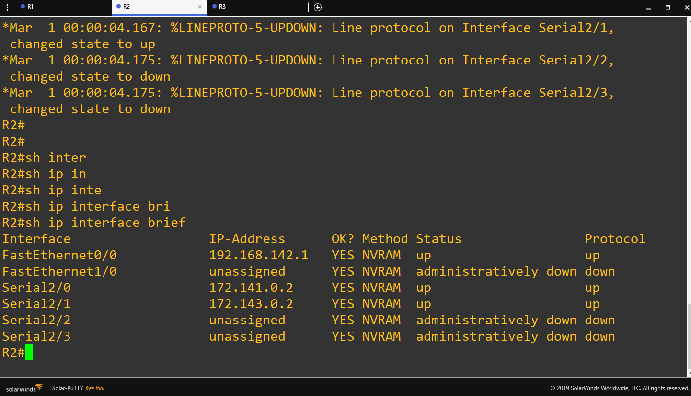

- sh ip ro

  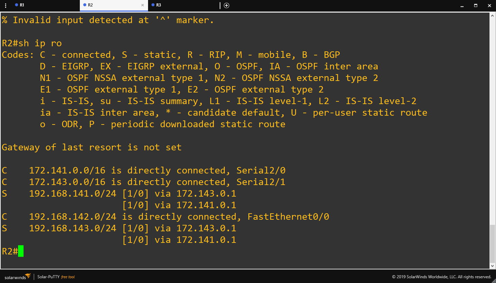

### Router 3

- sh ip interace brief

  

- sh ip ro

  

## PING desde VPC 1 a las demás VPC

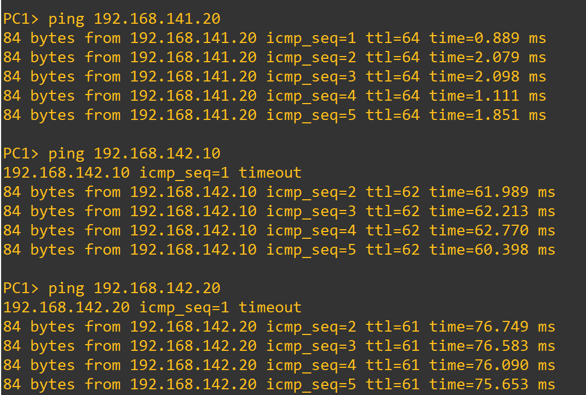

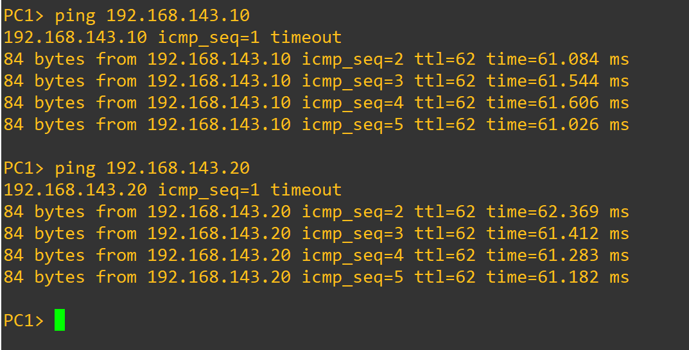

## Captura de paquetes en WireShark en R3 - R1

- Captura en R3 - R1

  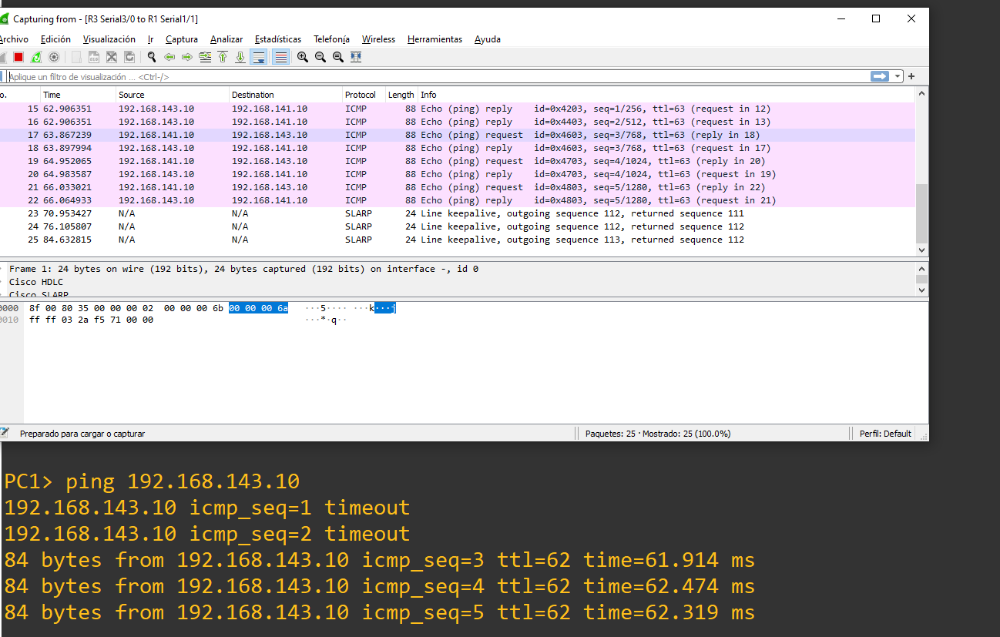

- Captura en R1 - R2

  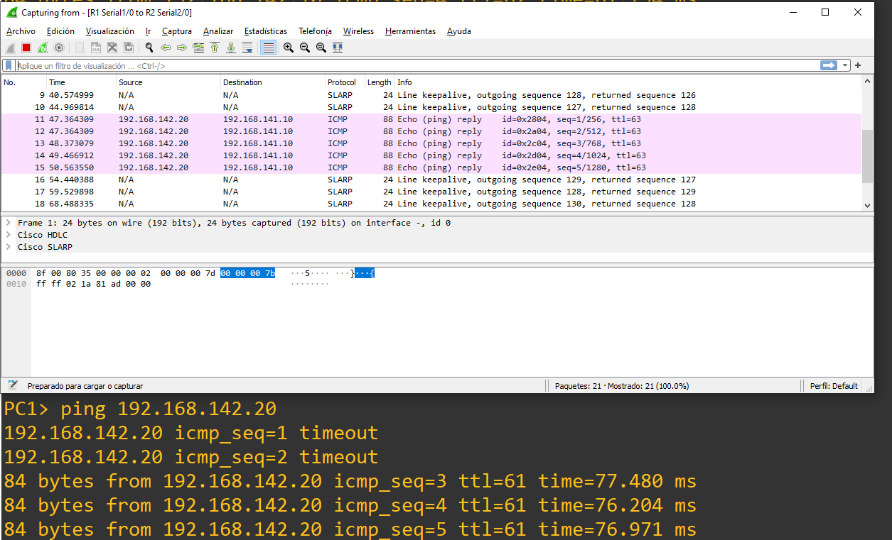

- Captura en R3 - R2

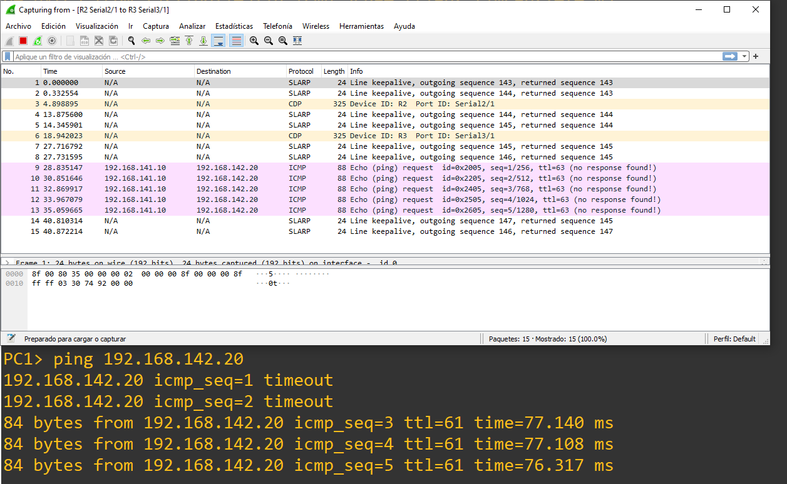
